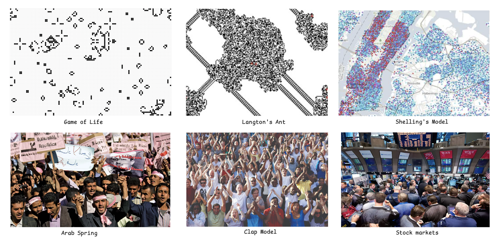
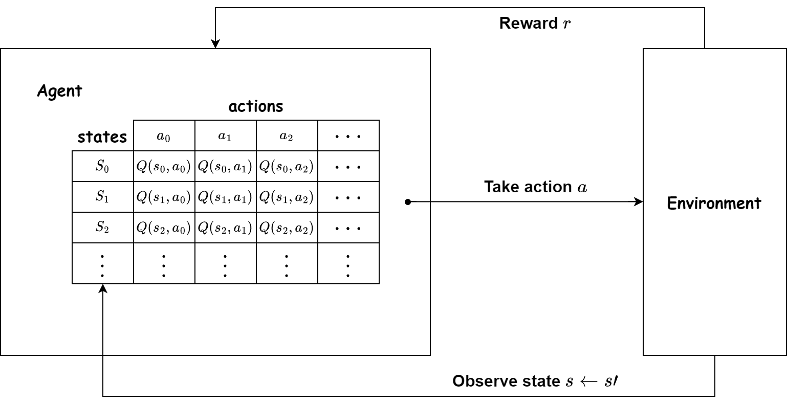
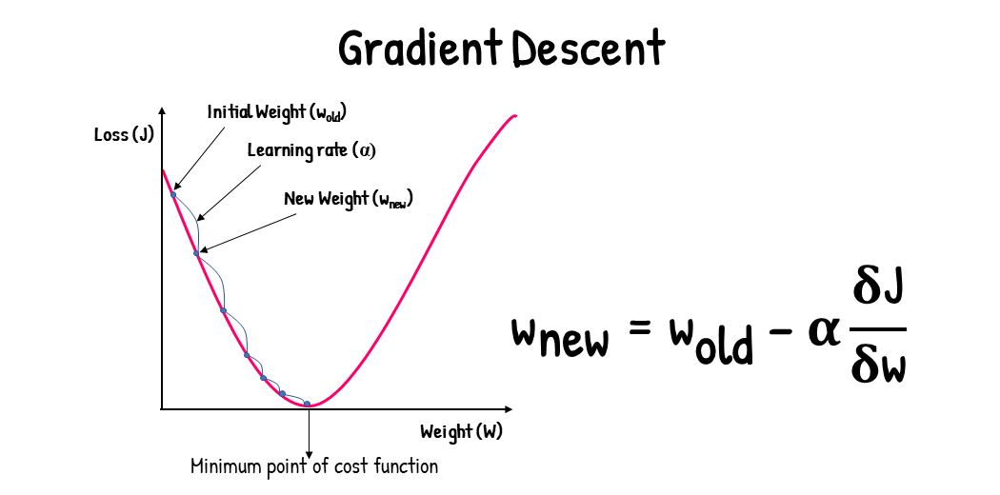
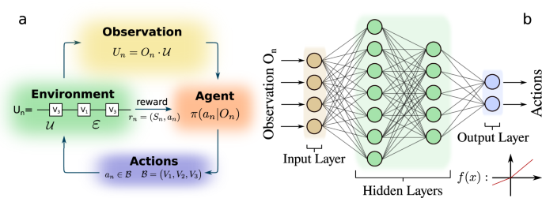
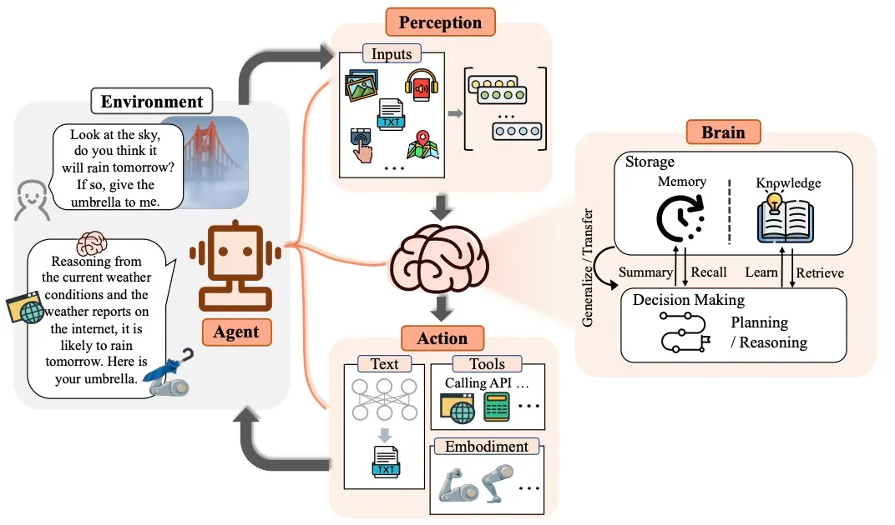

# An Overview of Agent Evolution

The following is my personal understanding of agent. I welcome any corrections or suggestions.

## What is an Agent?

My understanding of agents began with the concept of an Agent-Based Model (ABM), where an agent typically exhibits the following features:

- An agent is a distinct entity with attributes and identifiers, such as ID, name, and address
- An agent functions according to defined behavioral rules
- Agents can interact with each other
- Agents can interact with their environment

## Rule-Based Agents

Initially, agents were applied to simulate how individual interactions could influence macro-level systems. This provided a "bottom-up" approach to explaining the macro world through individual behaviors.

There are some interesting examples: Game of Life, Langton's Ant, and Schelling's model, as well as their later applications in studying social issues such as the Arab Spring, stock markets, and transportation systems.

These models share common characteristics: they use a few simple rules to simulate large-scale phenomena, have straightforward control flows, and enable large-scale simulations of individual behaviors.

## Heuristic Agents

As rule-based agents could not simulate complex behaviors, subsequent efforts aimed to make agents more human-like in their evolution. The first step was to incorporate dynamic decision-making mechanisms, applying Markov chains to the decision-making process. This enabled agents to dynamically adjust their behavior based on the current state, which is influenced by these behaviors. Below are two simple examples:

- Q-Learning: It provides a Q-Table composed of actions and rewards, where each value in the table represents the reward of taking a certain action in the current state. The agent chooses actions with higher rewards, and the results further update the Q-Table values, leading to continuous "learning" and the emergence of more "intelligent" individuals.

- Heuristic Algorithms: Genetic Algorithm, Ant Colony Optimization, and more widely used Gradient Optimization Algorithms in machine learning. These algorithms control decision-making through a few parameters, and the results can be used to update these parameters using methods like gradient descent. I previously used this approach to simulate the relationship between individual behaviors and policy-making, as described in [this paper](https://www.sciencedirect.com/science/article/abs/pii/S0959652622006692?via%3Dihub). One limitation of this approach is the design and implementation of validation.

## The Era of Complex Agents

- Deep Reinforcement Learning: With the advent of deep neural networks, agents have become even more "intelligent." Research on emergent effects has shifted from aggregating the behaviors of multiple agents to shaping more complex individuals through repeated iterations of a single agent (though this does not diminish the importance of the former, which remains more complex). For example, this approach is used in recommendation systems, and gaming companies use it to simulate other players, with agent players capable of surpassing human performance.

- AI Agents: These are fascinating entities emerging from the development of large language models (LLMs). These agents can leverage technologies like RAG to address domain-specific problems and, through multi-agent systems, build complex systems.

The capabilities by AI agents, driven by LLMs and deep neural networks, are astonishing! Perhaps a super assistant like "Jarvis" from Iron Man will become a reality in the near future, reshaping how we work and live, much like the Industrial Revolution did for humanity.

## Image Reference

- [Google](https://www.google.com)
- [Intro of AI agent, & AI agent projects summary](https://medium.com/@henryhengluo/intro-of-ai-agent-ai-agent-projects-summary-52f4a364ab86)