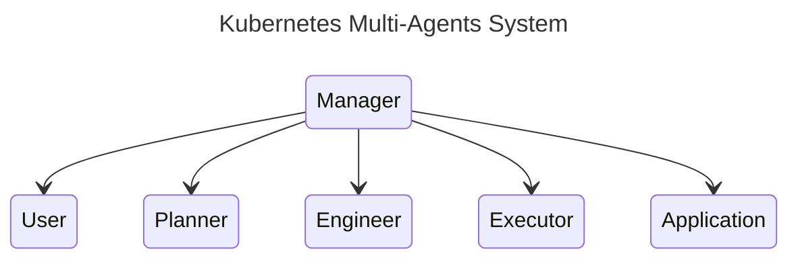

# Kubernetes Multi-Agents System

## Relationship

## Roles

- Kubernetes Engineer: Analyze the Planner's plan content or User's intent to write some shell/command

- Kubectl Proxy: Execute the code written by the 'Kubernetes Engineer' and report the result

- Planner: Given a task, determine what information is needed to complete the task. After each step is done by others, check the progress and instruct the remaining steps

- User proxy: On behalf the User/Admin, give the initial prompt to the group chat, Allow the user to comment on the result and ask other agent to modify the prompt.

- Application proxy: Provide the application information of the Planner want to achieve(ongoing...)

### TODO:

- Code Analyzer: Analyzes code from GitHub repositories.
  - Fetches code from repositories.
  - Analyzes the logic of the code.
  - Identifies errors/warning messages and provides possible advice and a summary.

- Program Debugger: Debugs and patches code based on analysis.
  - Attempts to patch fixes based on findings from the Code Analyzer.
  - Writes validations for the applied patches.